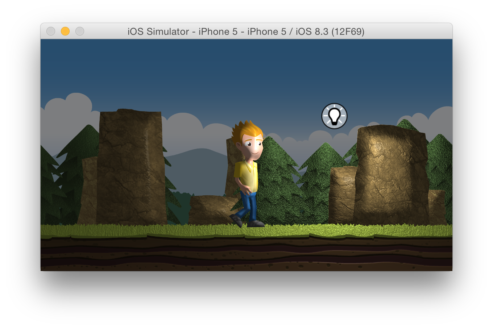

SpriteKit dynamic lighting demo
---

This simple SpriteKit project demonstrates how to use normal maps created with [SpriteIlluminator](https://www.codeandweb.com/spriteilluminator) to lighten your sprites.

A short tutorial can be found here: [2d dynamic lighting with SpriteKit](https://www.codeandweb.com/blog/2015/05/13/lighting-demo-swift)

